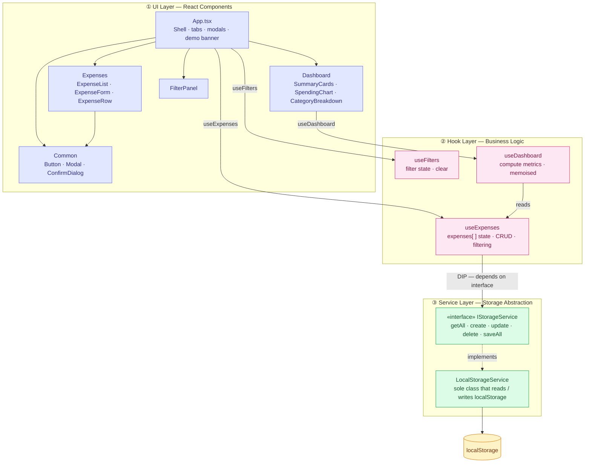
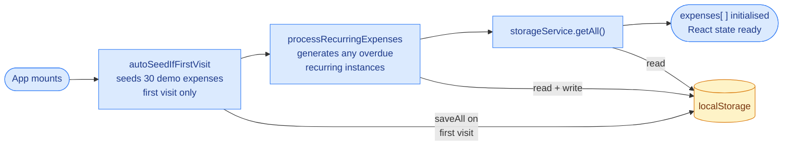
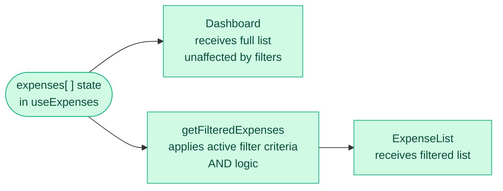

# Expense-Tracker PoC
## Claude Code Development for Regulated Workflows Utilizing Risk-Based Validation

---

## Executive Summary

The goal of this PoC is to showcase a modernized approach to the Software Development Life Cycle. By leveraging Claude Code to drive a fast-paced Agile environment, this project demonstrates how simple business processes—like expense tracking—can be executed under a rigorous Risk-Based Validation model. It acts as a blueprint for AI-assisted workflows, proving that cutting-edge validation standards can be maintained within a high-speed, automated development pipeline.

**Live demo:** https://vishu09ce.github.io/Expense-Tracker/

---

## Section 1: AI-Assisted Workflow

Instead of traditional coding, this PoC was built using an Agentic Workflow. The process focused on high-level architectural prompts and rigorous human oversight to ensure compliance.

### Key Performance Drivers

**Accelerated Time-to-Market:** Leveraged Claude Code to rapidly scaffold state management and UI components, significantly compressing the development lifecycle without sacrificing architectural integrity.

**Enhanced Code Quality:** Utilized AI-driven refactoring to identify and resolve technical debt in real-time, ensuring a modular, type-safe codebase (TypeScript) that meets enterprise standards.

**Increased Coverage:** Streamlined the generation of comprehensive test cases and technical summaries, allowing for a more robust validation of edge cases than traditional manual methods.

---

## Section 2: System Architecture & Data Flow

This section visualizes the structural integrity and data handling of the application. The architecture was orchestrated using SOLID principles to ensure the codebase remains modular, easy to audit, and resistant to regression during updates.

### System Architecture

---

### Data Flow

#### Initialization — on every page load

#### Read path — rendering

#### Write path — mutations

---

## Section 3: Technical Implementation

This section outlines the strategic selection of the technology stack. The focus was on choosing tools that provide the highest Return on Investment (ROI), long-term Stability, and seamless compatibility with AI-Assisted Workflows.

| Technology | Business Rationale |
|------------|-------------------|
| Vite & React | Chosen for rapid development velocity and a highly responsive User Experience (UX). |
| TypeScript | Implemented to enforce strict type-safety, reducing production errors and enhancing "Auditability" of the logic. |
| Recharts | Leveraged for modular, data-driven visualizations that provide immediate operational insights. |
| LocalStorage | Utilized for lightweight, client-side persistence to ensure data continuity without infrastructure overhead. |
| Tailwind CSS | Utilized for a standardized, enterprise-grade UI framework that minimizes custom CSS technical debt. |

---

## Section 4: Risk-Based Quality Assurance (RBQA)

This section defines the framework used to ensure the application is "fit for purpose." By applying Risk-Based Assurance, verification effort is concentrated where the impact of failure is highest.

### Risk-Based Classification

Requirements are stratified by their impact on Data Integrity and Regulatory Compliance as defined in the Testing Strategy:

- **High Process Risk (HPR):** Critical logic (financial calculations, data persistence). Validated via Scripted Testing with formal evidence.
- **Low Process Risk (LPR):** UI/UX and aesthetic elements. Verified via Unscripted / Exploratory Testing due to high detectability.

### Agentic Verification Loop

- **AI-Generated, Human-Verified:** Claude Code orchestrates the test suites, which are then manually audited to ensure absolute GxP alignment.
- **Robustness Testing:** Explicit focus on "Edge-Case Stressing" to ensure the system maintains data integrity under invalid inputs.

### Audit-Ready Traceability

The Requirements Traceability Matrix (RTM) serves as the final evidence of the Testing Strategy. It provides the objective proof required for a "validated state" by:

- **Deriving Proof:** Directly mapping every business requirement to its specific test execution and outcome.
- **Closing the Loop:** Ensuring 100% coverage of HPR items before release, creating a defensible record for regulatory review.

---

## Section 5: Project Documentation

All supporting documents produced as part of this PoC are catalogued below in SDLC order.

| # | SDLC Phase | Document | Description |
|---|------------|----------|-------------|
| 1 | Requirements & Planning | [Requirements Document](REQUIREMENTS.md) | Functional and non-functional requirements, data model, and future considerations |
| 2 | Design & Architecture | [Component Tree](docs/COMPONENT_TREE.md) | Full React component hierarchy with props and hook usage |
| 3 | Test Planning | [Testing Strategy](docs/TESTING_STRATEGY.md) | Risk classification, test types, coverage requirements, and quality gates |
| 4 | Test Execution & Verification | [Requirements Traceability Matrix](RTM.md) | All 53 requirements mapped to test cases and verified results |
