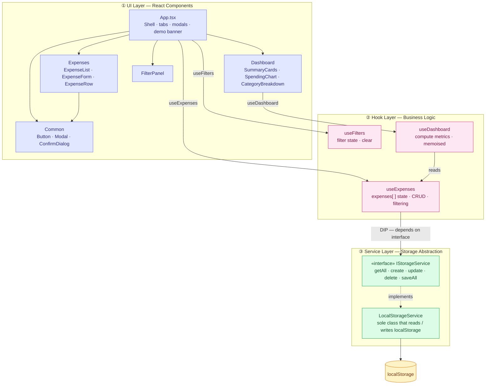
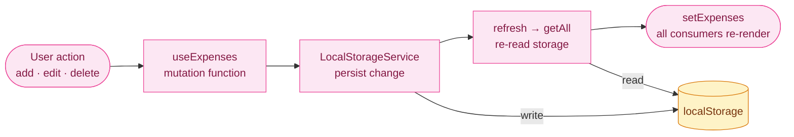

# Expense Tracker

A personal expense tracking SPA built with React, TypeScript, and Tailwind CSS. Add and manage expenses, visualise spending trends, automate recurring costs, and export to CSV.

**Live demo:** https://vishu09ce.github.io/Expense-Tracker/

---

## Tech Stack

| Layer | Technology |
|-------|------------|
| Framework | React 19 + Vite 8 |
| Language | TypeScript |
| Styling | Tailwind CSS v4 |
| Charts | Recharts |
| Storage | localStorage (browser-native) |
| Deployment | GitHub Pages |

---

## Features

- Add, edit, and delete expenses with date, amount, category, and description
- Six categories: Food, Transportation, Entertainment, Shopping, Bills, Other
- Filter and search by date range, category, and keyword — all criteria combined with AND logic
- Dashboard with all-time total, current month total, spending-over-time bar chart, and category breakdown
- Recurring expenses with Weekly / Monthly / Annual frequencies — overdue instances auto-generated on every page load
- CSV export of the full expense history with a date-stamped filename
- Demo data auto-seeded on first visit so new users land on a populated dashboard

---

## Architecture

The app is structured in three layers following SOLID principles. The key design decision is **Dependency Inversion at the storage boundary** — the hook layer depends on an interface (`IStorageService`), not on `LocalStorageService` directly. Swapping localStorage for a REST API requires only a new implementation class; no hooks or components change.



---

## Data Flow

### Initialization — on every page load


### Read path — rendering


### Write path — mutations



---

## Local Development

```bash
npm install
npm run dev       # start dev server at http://localhost:5173
npm run build     # production build
npm run preview   # preview production build locally
```

The dev toolbar (bottom-right corner) provides **Load Test Data** and **Clear All** buttons for testing. It is stripped from the production bundle at build time.

---

## Deployment

```bash
npm run deploy
```

Runs `npm run build` then publishes `dist/` to the `gh-pages` branch via the `gh-pages` package. GitHub Pages serves from that branch at https://vishu09ce.github.io/Expense-Tracker/.

---

## Project Docs

| Document | Description |
|----------|-------------|
| [RTM.md](RTM.md) | Requirements Traceability Matrix — all 53 requirements with test results |
| [docs/COMPONENT_TREE.md](docs/COMPONENT_TREE.md) | Full React component tree with props and responsibilities |
