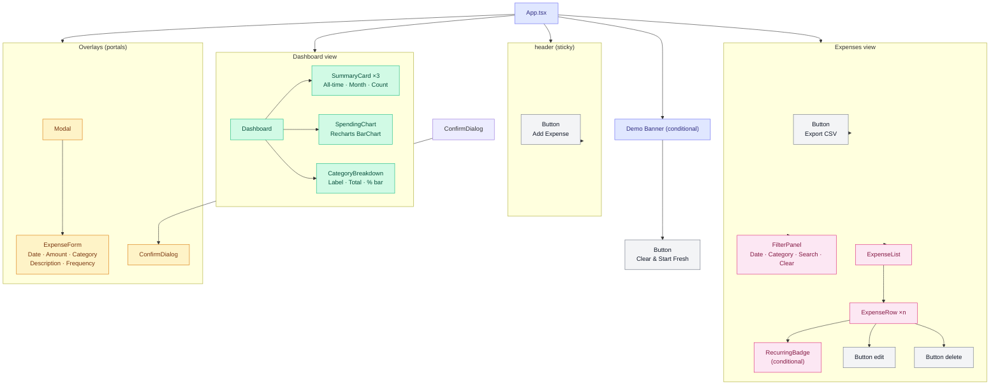

# Component Tree

Full React component hierarchy for the Expense Tracker app.

---

## Tree

```
App.tsx  (root — shell, tab nav, modal state, demo banner)
│
├── <header>  (sticky — branding, tab nav, Add Expense button)
│   └── Button  [variant=primary]  → opens add form
│
├── Demo Banner  (conditional — shown while DEMO_ACTIVE_KEY is set)
│   └── Button  [variant=secondary]  → clearDemoData()
│
├── Dashboard  (activeView === 'dashboard')
│   ├── SummaryCard  × 3
│   │     • All-time total
│   │     • Current month total
│   │     • Total expense count
│   ├── SpendingChart
│   │     • Recharts ResponsiveContainer > BarChart
│   │     • X-axis: month labels  |  Y-axis: $ amount
│   └── CategoryBreakdown
│         • Category label + formatted total + percentage bar
│         • Sorted by total descending
│
├── Expenses View  (activeView === 'expenses')
│   ├── Button  [variant=secondary]  → exportExpensesToCSV()
│   ├── FilterPanel
│   │     • Date range inputs (startDate, endDate)
│   │     • Category select
│   │     • Description search input
│   │     • Clear filters button (visible when hasActiveFilters)
│   │     • Result count badge
│   └── ExpenseList
│         └── ExpenseRow  × n
│               ├── RecurringBadge  (conditional — isRecurring === true)
│               ├── Button  [icon=edit]   → opens edit form
│               └── Button  [icon=delete] → opens confirm dialog
│
├── Modal  (isOpen={showForm})
│   └── ExpenseForm
│         • Date, Amount, Category (required)
│         • Description (optional)
│         • Frequency select (visible when isRecurring)
│         ├── Button  [variant=primary]   → handleFormSave()
│         └── Button  [variant=secondary] → handleFormClose()
│
└── ConfirmDialog  (isOpen={Boolean(deletingExpense)})
      ├── Button  [variant=danger]     → handleDeleteConfirm()
      └── Button  [variant=secondary]  → setDeletingExpense(null)
```

---

## Mermaid Diagram



---

## Hook Usage by Component

| Component | Hook | What it reads / calls |
|-----------|------|-----------------------|
| `App.tsx` | `useExpenses` | `expenses`, `addExpense`, `editExpense`, `removeExpense`, `getFilteredExpenses` |
| `App.tsx` | `useFilters` | `filters`, `hasActiveFilters`, `setFilter`, `clearFilters` |
| `Dashboard` | `useDashboard(expenses)` | `allTimeTotal`, `currentMonthTotal`, `monthlyTotals`, `categoryTotals` |

All other components receive data exclusively via props — no hook calls outside the three above.
